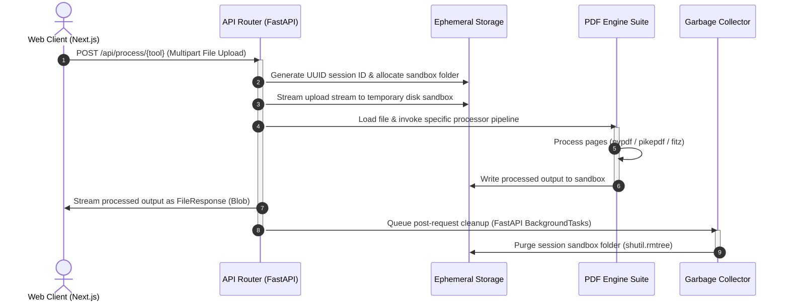

# SwiftPDF Intelligence Suite

[](https://fastapi.tiangolo.com)
[](https://nextjs.org)
[](https://www.docker.com)
[](https://www.python.org)

SwiftPDF is a stateless, privacy-first PDF manipulation and document conversion platform. It combines a high-concurrency **FastAPI** backend with a dynamic **Next.js 16** (React 19) frontend to enable document processing directly in the browser.

Unlike conventional PDF utilities that store user documents on remote third-party databases, SwiftPDF operates entirely in ephemeral storage sessions. Files are processed in isolated environments and deleted immediately after transmission, ensuring compliance with data protection regulations such as GDPR and HIPAA.

---

## 🛠️ The 42-Tool Intelligence Ecosystem

SwiftPDF provides a comprehensive suite of **42 precise, production-grade tools** for document manipulation, security, conversion, and analysis:

### 1. Layout & Structural Engineering (10 Tools)

* **Merge PDF**: Consolidate multiple documents into a single authoritative file.
* **Split PDF**: Deconstruct documents with page range filters.
* **Organize PDF**: Drag-and-drop sortable page order workspace.
* **Rotate PDF**: Correct document orientation (90°, 180°, 270°).
* **Crop PDF**: Trim page margins to adjust coordinate boundaries.
* **Remove Pages**: Surgically delete unwanted page indices from a document.
* **Extract Pages**: Isolate specific page ranges into new PDF files.
* **Repair PDF**: Re-save corrupted PDF streams to restore structural integrity.
* **Page Numbers**: Dynamically inject sequential page numbering footnotes.
* **Visual PDF Editor (Swift Editor)**: Modify text coordinates with font, size, and color matching.

### 2. Security & Compliance (5 Tools)

* **Lock PDF**: Enforce password-restricted access permissions via AES-256 encryption.
* **Unlock PDF**: Remove security credentials from authorized files.
* **Redact PDF**: Permanently remove sensitive strings and vectors with visual black box covers.
* **Sign PDF**: Authenticate documents by embedding digital signature overlay coordinates.
* **Watermark PDF**: Apply semi-transparent brand marker text at a 45-degree angle.

### 3. Universal Document Conversions (22 Tools)

* **Word to PDF**: Convert `.docx` and `.doc` files to PDF.
* **Excel to PDF**: Transform spreadsheets into professional tabular PDFs.
* **PPT to PDF**: Convert PowerPoint slide decks into page-by-page PDFs.
* **PDF to Word**: Deconstruct PDFs back into editable Word documents.
* **PDF to Excel**: Extract tabular structures into multi-sheet Excel workbooks.
* **HTML to PDF**: Render web pages or raw HTML code into standard PDF sheets.
* **JSON to PDF**: Format structured JSON strings into readable PDF reports.
* **XML to PDF**: Map raw XML tag structures into standardized PDF layouts.
* **YAML to PDF**: Render configuration structures into clean PDF files.
* **PDF to JSON**: Extract text and metadata structures into machine-readable JSON.
* **PDF to XML**: Translate layout text streams into structured XML tags.
* **PDF to YAML**: Output extracted textual data blocks in YAML format.
* **JPG to PDF**: Package high-resolution JPG images into a single PDF.
* **Scan to PDF**: Assemble raw images into a clean multi-page document.
* **PSD to PDF**: Extract composite layers of Photoshop files into PDF sheets.
* **TIFF to PDF**: Translate multi-page TIFF image series into PDFs.
* **PDF to JPG**: Decompose PDF pages into individual high-fidelity JPEGs.
* **PDF to TIFF**: Output PDF layout structures as standard TIFF streams.
* **Base64 to PDF**: Decode base64 strings back into standardized PDF documents.
* **PDF to Base64**: Encode PDF documents into base64 strings for easy database embedding.

### 4. Advanced AI & Analytics (5 Tools)

* **Remove BG**: Segment document page scans to strip away backgrounds using U2Net.
* **OCR PDF**: Apply local Tesseract OCR to convert raster images into selectable text.
* **PDF/A Archive**: Convert standard files into ISO-compliant long-term archive formats.
* **Extract Text**: Harvest semantic text data using PyMuPDF and OCR fallbacks.
* **Compare PDF**: Run structural analyses to report match ratios and differences.

---

## 🏗️ Architecture & Data Flow

SwiftPDF utilizes a decoupled client-server architecture designed for high throughput and zero persistence.



### 1. Ephemeral File Lifecycle & Storage Sandbox

When a file is uploaded, the backend generates a unique `uuid4` transaction session ID. A sandbox directory is initialized under the system's temporary storage folder (`tempfile.gettempdir()/pdf_converter_sessions/{session_id}`). All processing is scoped to this directory.

### 2. Dual-Layer Garbage Collection (GC)

To prevent storage leaks and disk exhaustion, the backend implements a redundant GC strategy:

* **Request-Level Cleanup**: Upon completing an API route execution, the server triggers a post-response callback via FastAPI's `BackgroundTasks` to synchronously delete the specific session sandbox (`shutil.rmtree`).
* **Daemon Cleanup Loop**: An asynchronous task runs continuously within the FastAPI lifespan. Every 10 minutes, it scans the root application temp folder and deletes any session sandboxes whose modification time (`mtime`) is older than 30 minutes. This cleans up files abandoned due to client cancellations, network failures, or server crashes.

---

## 🛠️ Technology Stack & Justification

### Frontend

* **Next.js 16 (React 19, TypeScript)**: Chosen for its robust page performance, component architecture, and support for concurrent rendering.
* **Tailwind CSS v4**: Provides compile-time CSS optimization and utility classes to build a dark-mode interface.
* **Framer Motion v12**: Powering layout transitions and animations for operations like drag-and-drop page sorting.
* **@dnd-kit (Core / Sortable)**: Used to manage document page reorganization. It processes keyboard/pointer events and provides accessible layout reordering.

### Backend

* **FastAPI (Python 3.10)**: Provides high concurrency through Python's ASGI standard. FastAPI handles async file streams natively, generates automatic interactive OpenAPI documentation, and integrates easily with the Python document processing ecosystem.
* **Uvicorn**: An ASGI web server implementation used to run the API with low overhead.

### Document Processing Engines

Instead of relying on a single monolith library, SwiftPDF routes tasks to specialized open-source tools:

* **`pypdf`**: Used for quick structural operations (merging, splitting, rotating, cropping, page removal) because of its pure-python speed and low resource usage.
* **`pikepdf`**: A C++ binding to `QPDF`. Chosen for file compression (linearization, object stream generation, unreferenced resource removal), AES-256 encryption/decryption, metadata manipulation (Dublin Core), and exporting to standardized archive PDF/A formats.
* **`PyMuPDF` (fitz)**: Chosen for its fast layout rendering. It converts PDF pages to high-DPI raster images for visual previews, extracts precise layout metadata (text spans, colors, alignments), handles search-and-replace text redactions, and executes page-by-page document comparisons.
* **`reportlab`**: Used to generate custom canvas overlays for watermarks, digital signature markers, page numbering, and formatting structured text files (JSON, XML, YAML) into formatted PDF reports.
* **`pdfplumber` & `pandas`**: Handles table extraction by identifying grid boundaries and rendering tabular data into structured Excel spreadsheets.
* **`rembg` & `ONNX Runtime`**: Running local machine learning inference (U2Net model) to detect and remove backgrounds from document pages.
* **`pytesseract`**: Executes local Optical Character Recognition (OCR) to convert scanned images or non-selectable text documents into search-friendly PDFs.
* **`docx2pdf` & `comtypes`**: Harnesses native Windows COM Interop to convert Word, Excel, and PowerPoint files to PDF with layout accuracy.

---

## 📂 Project Structure

```text
SwiftPDF/
├── backend/
│   ├── main.py                 # FastAPI application entry & context lifecycle
│   ├── Dockerfile              # Multi-dependency debian slim base image
│   ├── requirements.txt        # Backend dependencies & library pins
│   ├── start_backend.bat       # Backend local virtualenv setup & launcher script
│   ├── routers/
│   │   └── pdf_routes.py       # API endpoint routes & multipart file upload handlers
│   ├── utils/
│   │   ├── ai_processors.py    # Standardized text processing pipelines
│   │   ├── file_utils.py       # Sandbox creation & dual-layer GC logic
│   │   └── pdf_processors.py   # Multi-engine processing pipelines (Fitz, Pikepdf, etc.)
│   └── tests/
│       └── test_api.py         # Integration & unit test suites (PyTest)
├── frontend/
│   ├── next.config.ts          # Rewrites & production environment parameters
│   ├── package.json            # Node.js dependencies & execution scripts
│   ├── Dockerfile              # Multi-stage production container build
│   ├── tailwind.config.js      # Layout customization & theme definitions
│   ├── app/
│   │   ├── layout.tsx          # Global provider wrappers & layout architecture
│   │   ├── page.tsx            # Main tools dashboard entry
│   │   └── tools/[tool]/       # Dynamic router handling unique parameters per tool
│   └── components/
│       ├── FileUpload.tsx      # Dropzone ingestion component
│       ├── PDFEditor.tsx       # Interactive document layout visual editor
│       ├── PDFOrganizer.tsx    # Drag-and-drop sortable page workspace
│       └── ToolInterface.tsx   # Parameter collector & API execution coordinator
├── docker-compose.yml          # Local container orchestration configuration
├── netlify.toml                # Production routing & API proxy configurations
└── package.json                # Project root monorepo script manager
```

---

## ⚙️ Key Features & Internal Implementation

| Feature Group | Tool | Backend Processor Library | Execution Strategy |
| :--- | :--- | :--- | :--- |
| **Structural** | Merge PDF | `pypdf.PdfWriter` | Appends byte streams of multiple files sequentially into a single file object. |
| | Split / Extract | `pypdf.PdfReader` | Parses string range inputs (e.g., `1-3, 5`), builds a page set, and writes pages to a new document. |
| | Organize | `pypdf.PdfReader` | Accepts a JSON array of page indices and rotation angles, rewriting the document order. |
| | Rotate / Crop | `pypdf` / `fitz` | Modifies the document page's `/Rotate` parameter or updates the bounding coordinates `/MediaBox`. |
| **Security** | Lock / Unlock | `pikepdf` | Enforces or decrypts password parameters using AES-256 encryption. |
| | Redact | `fitz` (PyMuPDF) | Executes string matching on coordinates, places black fills over matches, and cleans the text structure. |
| | Signature | `reportlab` & `pypdf` | Renders visual initials onto an overlay PDF and merges the vector layer onto the target page. |
| | Watermark | `reportlab` & `pypdf` | Generates a transparent text layout and merges it onto the background of every page. |
| **Conversion** | Office to PDF | `docx2pdf`/`comtypes` | Activates Microsoft COM interop to export documents as PDFs using Word or PowerPoint. |
| | PDF to Word | `pdf2docx` | Translates PDF layout elements (images, text, tables) into matching Office Open XML documents. |
| | PDF to Excel | `pdfplumber` & `pandas` | Extracts grid data, parses rows and columns, and writes sheets to an `.xlsx` workbook. |
| | Data to PDF | `reportlab` | Wraps data characters into canvas lines, implementing page-breaking logic. |
| **AI & OCR** | Background Strip | `rembg` & `onnxruntime` | Converts PDF pages into images, applies U2Net segmenting, and saves transparent PNGs back to a PDF. |
| | OCR PDF | `pytesseract` | Extracts high-res images, runs Tesseract OCR engine, and saves search-friendly PDF bytes. |
| | PDF/A Archive | `pikepdf` | Enforces PDF/A standards for color profiles and embedded fonts for archive compliance. |

---

## 🛠️ Technical Challenges & Solutions

### 1. Typography-Synchronized Inline PDF Editing

* **The Challenge**: In visual PDF editing, replacing a word must look natural. Normal PDF editing engines append text layers without matching original typography parameters (font face, size, color, baseline), resulting in mismatched overlays.
* **The Solution**: When a user selects a word to edit, SwiftPDF requests page metadata. Using PyMuPDF’s `page.get_text("dict")`, the backend scans text blocks to extract:
  1. The exact font name mapping (e.g., matching Courier, Times, or Helvetica variants).
  2. The font size.
  3. The exact color format (converting the internal PDF 32-bit color integer into RGB float values).
  4. The exact baseline coordinate origin.
  
  When saving, the backend uses `add_redact_annot` to white out the original text, applies the redaction to delete the underlying characters, and inserts the new text using the extracted typography parameters at the original baseline.

```python
# Extracting exact font metadata in backend/utils/pdf_processors.py
info = page.get_text("dict", clip=best_instance)
span = info["blocks"][0]["lines"][0]["spans"][0]

# Extract RGB float values from raw integer color
c = span["color"]
font_color = (((c >> 16) & 255)/255, ((c >> 8) & 255)/255, (c & 255)/255)
font_size = span["size"]
baseline = span["origin"]
```

### 2. Multi-threaded COM Interop Synchronization on Windows

* **The Challenge**: Converting Word/Excel/PowerPoint documents locally on Windows relies on Microsoft Office APIs via `comtypes` and `docx2pdf`. In an asynchronous FastAPI environment, these conversions run in backend worker threads. Calling COM objects from threads other than the one that initialized them throws thread-access errors.
* **The Solution**: We wrapped all COM conversions with thread-initialization steps. Before calling Office APIs, the process initializes the Component Object Model library via `pythoncom.CoInitialize()`. Once complete, it calls `pythoncom.CoUninitialize()` to free resources, ensuring safe multi-threaded executions.

```python
# COM threading safety wrapper
import pythoncom
import comtypes.client

pythoncom.CoInitialize()
try:
    powerpoint = comtypes.client.CreateObject("Powerpoint.Application")
    deck = powerpoint.Presentations.Open(abs_file_path, 1, 0, 0)
    deck.SaveAs(abs_output_path, 32) # Export as PDF format (Enum 32)
    deck.Close()
    powerpoint.Quit()
finally:
    pythoncom.CoUninitialize()
```

### 3. Orphaned File Management on Aborted Connections

* **The Challenge**: Large file transformations can consume significant disk space. If a client disconnects mid-request, standard server code might skip cleanup steps, leaving files on disk.
* **The Solution**: The API routes upload files directly into sandboxed directories. The cleanup call is passed to FastAPI’s `BackgroundTasks`, which executes after the HTTP response is fully sent. If a route fails during execution, a `try-except` block runs the cleanup before raising the error. The backend also runs a lifespan-managed daemon loop that cleans up any sandboxes older than 30 minutes.

---

## 🚀 Installation & Local Development


### Prerequisites

* **Python**: Version 3.10 or higher.
* **Node.js**: Version 18.0 or higher.
* **Tesseract OCR**: Required for OCR PDF capabilities. Install and add the binary folder path to your system's `PATH`.
* **Microsoft Office**: Required for local Office conversion tools (Word, Excel, PowerPoint) on Windows.

---

### Step-by-Step Installation

#### 1. Clone the Repository

```bash
git clone https://github.com/sumitsharma29/SwiftPDF.git
cd SwiftPDF
```

#### 2. Run Using Docker Compose (Recommended)

This approach configures dependencies, poppler utilities, and libraries inside isolated containers.

```bash
# Spin up both client (port 3000) and API (port 8000)
npm run docker:up

# Tear down container services
npm run docker:down
```

#### 3. Manual Local Installation

##### Start Backend Service

The project includes a Windows batch script (`start_backend_root.bat`) that handles virtual environment creation, dependencies installation, and starts the FastAPI server:

```powershell
.\start_backend_root.bat
```

Alternatively, configure and run manually:

```bash
cd backend
python -m venv venv
source venv/bin/activate  # On Windows: .\venv\Scripts\activate
pip install -r requirements.txt
python -m uvicorn main:app --reload --port 8000
```

##### Start Frontend Dev Server

In a separate terminal, install the Node dependencies and run the Next.js development server:

```bash
cd frontend
npm install
npm run dev
```

Open `http://localhost:3000` to view the application.

---

## 🧪 Testing

The backend uses **PyTest** to verify core endpoints. To run tests locally:

```bash
cd backend
pytest -v
```

Tests generate structured mock PDFs in memory using `reportlab.pdfgen.canvas` to verify file upload, compression, routing, and deletion mechanics.

---

## 📡 API Reference Documentation

All endpoints receive file payloads as `multipart/form-data`. The interactive documentation is available at `http://localhost:8000/api/docs`.

### 1. Merge PDFs

* **Endpoint**: `POST /api/process/merge`
* **Body**: `files: List[UploadFile]`
* **Response**: `application/pdf` binary stream

### 2. Compress PDF

* **Endpoint**: `POST /api/process/compress`
* **Body**:
  * `file: UploadFile`
  * `level: Form[str]` (Options: `low`, `medium`, `high`)
* **Response**: Optimized `application/pdf` binary stream

### 3. Visual PDF Edit

* **Endpoint**: `POST /api/process/edit`
* **Body**:
  * `file: UploadFile`
  * `edits: Form[str]` (JSON string payload containing page index, coordinates, text, and edit mode)
* **Response**: Modified `application/pdf` binary stream

#### Format of the edits JSON string

```json
[
  {
    "page": 0,
    "x": 120.5,
    "y": 450.2,
    "mode": "replace",
    "search_text": "Original Word",
    "text": "Replacement Word"
  }
]
```

### 4. Background Removal

* **Endpoint**: `POST /api/process/remove-bg`
* **Body**: `file: UploadFile`
* **Response**: Segmented `application/pdf` binary stream

---

## 🔮 Roadmap & Future Improvements

1. **WebAssembly (WASM) Integration**: Port PDF processing libraries (such as `pikepdf` / `QPDF` and `MuPDF` / `fitz`) directly to client-side WASM. This shifts processing workloads entirely to the browser, reducing hosting costs and ensuring data privacy.
2. **LibreOffice Cloud Fallback**: Implement a LibreOffice-based Docker container structure for non-Windows cloud deployments. This replaces Windows COM APIs with headless CLI conversion tools.
3. **Advanced Vector Redaction**: Update redaction steps to clean up all vector curves, metadata annotations, and search indices behind redacted blocks to prevent recovery.
